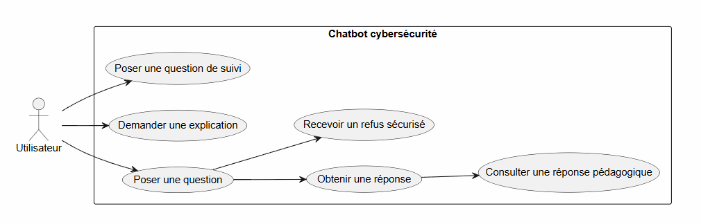
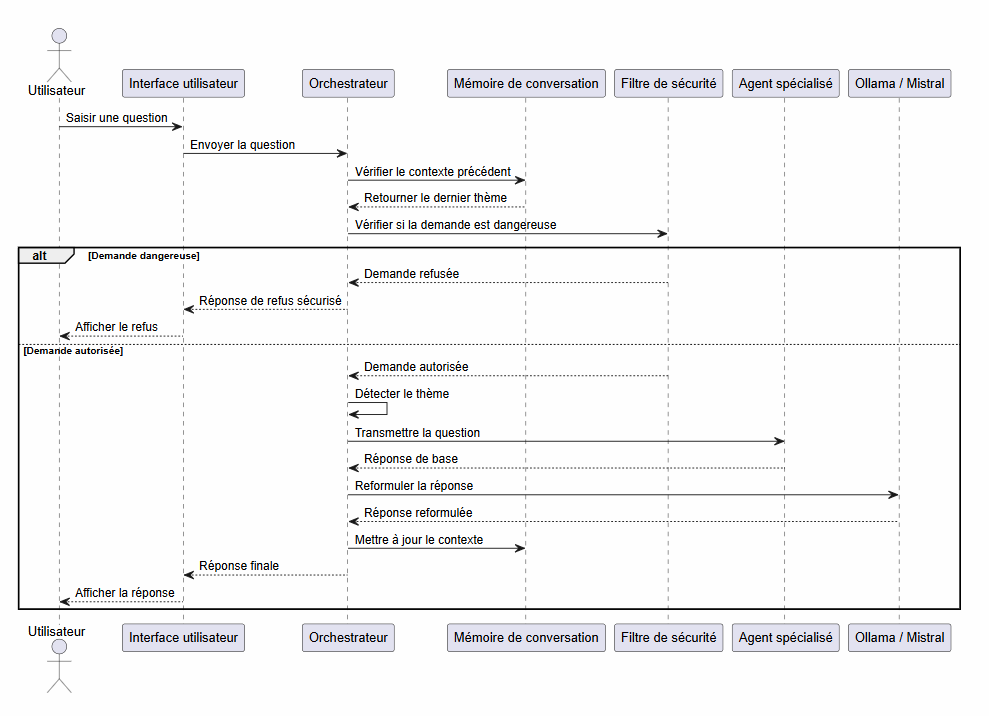
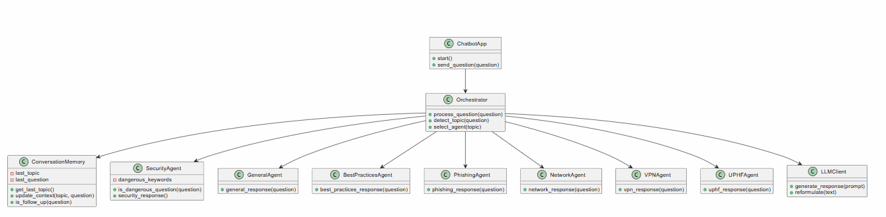
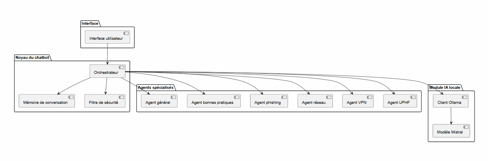
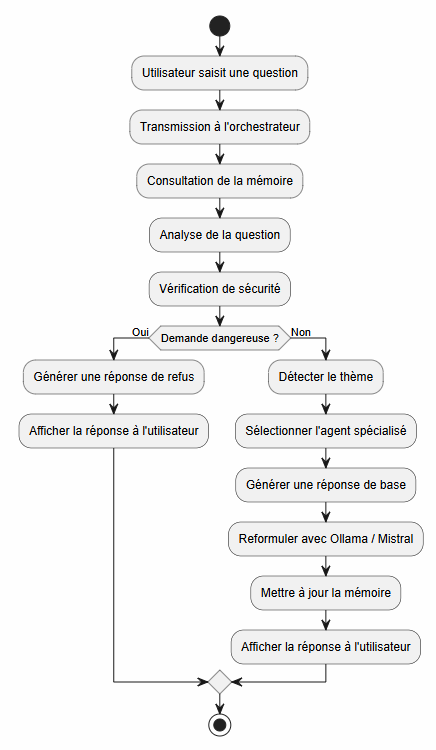

## 1. Introduction

Ce document présente la conception technique du chatbot cybersécurité.  
L’objectif est de transformer les besoins identifiés en une solution claire, modulaire et réalisable.

Le chatbot permet à l’utilisateur de poser des questions liées à la cybersécurité et d’obtenir des réponses simples, pédagogiques et sécurisées.  
La solution repose sur un orchestrateur, des agents spécialisés, un filtre de sécurité, une mémoire de conversation et un modèle local Ollama/Mistral.

## 2. Architecture générale de la solution

Le chatbot suit une architecture modulaire. Chaque composant possède un rôle précis afin de faciliter la maintenance et l’évolution du projet.

```text
Utilisateur
    ↓
Interface utilisateur
    ↓
Orchestrateur
    ↓
Détection du thème + mémoire + sécurité
    ↓
Agent spécialisé
    ↓
Ollama / Mistral
    ↓
Réponse finale
```

## 2.1 Interface utilisateur

L’interface permet à l’utilisateur de saisir une question et d’afficher la réponse du chatbot.  
Elle peut être une interface console ou une interface web simple.

Ses rôles principaux sont :

- récupérer la question ;
- transmettre la question à l’orchestrateur ;
- afficher la réponse finale.

## 2.2 Orchestrateur

L’orchestrateur est le cœur du système.  
Il reçoit la question, détecte le thème, vérifie le contexte, applique le filtre de sécurité et sélectionne l’agent adapté.

Il permet de centraliser le traitement et de séparer clairement les responsabilités entre les différents modules.

## 2.3 Agents spécialisés

Les agents spécialisés répondent à des thèmes précis :

- `general_agent` : questions générales ;
- `best_practices_agent` : bonnes pratiques ;
- `phishing_agent` : phishing ;
- `network_agent` : réseau ;
- `vpn_agent` : VPN ;
- `uphf_agent` : contexte UPHF ;
- `security_agent` : demandes dangereuses.

Cette organisation rend le projet plus lisible et plus facile à faire évoluer.

## 2.4 Filtre de sécurité

Le filtre de sécurité bloque les demandes dangereuses ou malveillantes.  
Par exemple, les questions liées au piratage, au vol de mot de passe ou au contournement de protection ne doivent pas recevoir de réponse exploitable.

Le chatbot répond alors de manière préventive et pédagogique.

## 2.5 Mémoire de conversation

La mémoire conserve le dernier thème abordé afin de mieux gérer les questions de suivi.

Exemple :

```text
Utilisateur : Comment reconnaître un mail de phishing ?
Utilisateur : Et comment s’en protéger ?
```

Le chatbot comprend que la deuxième question concerne toujours le phishing.

## 2.6 Modèle local Ollama / Mistral

Ollama permet d’exécuter localement le modèle Mistral.  
Dans le projet, il sert principalement à reformuler les réponses afin de les rendre plus claires, naturelles et pédagogiques.

## 3. Choix technologiques

Le projet utilise des technologies simples et adaptées à un chatbot modulaire.

## 3.1 Python

Python est utilisé pour développer la logique principale du chatbot, les agents, l’orchestrateur, la mémoire et l’intégration avec Ollama.  
Il est choisi pour sa simplicité, sa lisibilité et son usage fréquent en cybersécurité et en intelligence artificielle.

## 3.2 Ollama / Mistral

Mistral est utilisé comme modèle de langage local.  
Ollama permet de l’exécuter facilement sur la machine, sans dépendre directement d’une API externe.

Ce choix permet :

- de tester localement ;
- de garder le contrôle sur l’environnement ;
- d’améliorer la formulation des réponses.

## 3.3 Architecture modulaire

Le projet est divisé en plusieurs modules :

- interface utilisateur ;
- orchestrateur ;
- agents spécialisés ;
- mémoire ;
- filtre de sécurité ;
- module LLM.

Cette structure facilite la maintenance et l’ajout de nouvelles fonctionnalités.

## 3.4 GitHub

GitHub est utilisé pour stocker le code source, suivre les modifications et faciliter le travail en groupe.

## 4. Modélisation des données

Le chatbot ne nécessite pas de base de données complexe dans sa première version.  
Il manipule surtout des données temporaires pendant le traitement d’une question.

Les principales données sont :

- la question utilisateur ;
- le thème détecté ;
- l’agent sélectionné ;
- l’état de sécurité ;
- la réponse générée ;
- le dernier contexte de conversation.

Exemple de structure logique :

```json
{
  "question": "Comment reconnaître un mail de phishing ?",
  "theme_detecte": "phishing",
  "agent_selectionne": "phishing_agent",
  "demande_dangereuse": false,
  "reponse": "Un mail de phishing contient souvent des liens suspects."
}
```

Une base de données pourrait être ajoutée plus tard pour conserver l’historique des conversations ou gérer des utilisateurs.

## 5. Conception des interfaces utilisateur

L’interface utilisateur doit rester simple et compréhensible.  
Elle permet de poser une question, d’envoyer la demande au chatbot et d’afficher la réponse.

## 5.1 Interface console

Dans une première version, le chatbot peut fonctionner dans un terminal.

Exemple :

```text
Utilisateur : C’est quoi un VPN ?
Chatbot : Un VPN permet de créer une connexion sécurisée entre votre appareil et un serveur distant.
```

Cette interface suffit pour tester les fonctionnalités principales.

## 5.2 Interface web légère

Une interface web peut être prévue pour améliorer l’expérience utilisateur.  
Elle pourrait contenir :

- une zone de discussion ;
- un champ de saisie ;
- un bouton d’envoi ;
- un affichage clair des réponses.

Maquette simplifiée :

```text
+--------------------------------------------------+
| Chatbot cybersécurité                            |
+--------------------------------------------------+
| Utilisateur : Comment éviter le phishing ?       |
| Chatbot : Il faut vérifier les liens, l'adresse...|
+--------------------------------------------------+
| Écrire une question...                  [Envoyer] |
+--------------------------------------------------+
```

## 5.3 Gestion des refus

Si une demande est dangereuse, l’interface affiche une réponse de refus sécurisé.

Exemple :

```text
Je ne peux pas aider à pirater un compte.
Je peux cependant expliquer comment protéger un compte.
```

## 6. Conception UML

La conception UML permet de représenter le fonctionnement du chatbot sous forme de diagrammes.  
Les diagrammes ont été générés avec PlantUML puis intégrés sous forme d’images.

## 6.1 Diagramme de cas d’utilisation



Ce diagramme présente les principales interactions entre l’utilisateur et le chatbot : poser une question, demander une explication, obtenir une réponse ou recevoir un refus sécurisé.

## 6.2 Diagramme de séquence



Ce diagramme décrit le traitement complet d’une question : saisie, analyse, vérification de sécurité, sélection de l’agent, génération et affichage de la réponse.

## 6.3 Diagramme de classes



Ce diagramme montre les principaux modules du projet : application, orchestrateur, mémoire, agents spécialisés, filtre de sécurité et client LLM.

## 6.4 Diagramme de composants



Ce diagramme présente l’organisation technique de la solution : interface, noyau du chatbot, agents spécialisés et module IA locale.

## 6.5 Diagramme d’activité



Ce diagramme montre les étapes de traitement d’une question, depuis la saisie jusqu’à l’affichage de la réponse finale.

## 7. Spécifications détaillées

Le chatbot doit permettre à l’utilisateur de poser une question liée à la cybersécurité et de recevoir une réponse claire, pédagogique et sécurisée.

Le traitement suit les étapes suivantes :

```text
Question utilisateur
        ↓
Analyse par l’orchestrateur
        ↓
Détection du thème
        ↓
Vérification de sécurité
        ↓
Sélection de l’agent adapté
        ↓
Génération ou reformulation de la réponse
        ↓
Affichage de la réponse finale
```

Les demandes dangereuses sont refusées par le filtre de sécurité.  
Les questions autorisées sont traitées par l’agent spécialisé correspondant, puis la réponse peut être améliorée avec Ollama/Mistral.

## 8. Conclusion

Cette conception technique permet de définir une solution simple, modulaire et sécurisée pour le chatbot cybersécurité.  
L’architecture proposée facilite le développement, la maintenance et les futures évolutions du projet.
